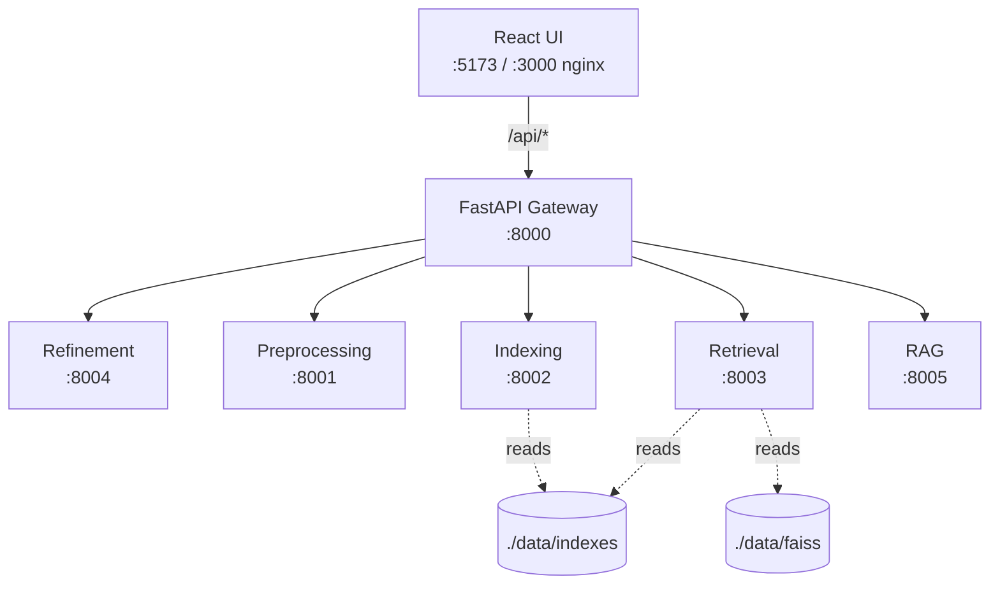

# Architecture

> Populated in **Phase 6**. This file holds the high-level SOA diagram and a description
> of the inter-service communication contract.

## Mermaid sketch (placeholder)

## Services (from SOLO_DEVELOPER_GUIDE §6.1)

| Service | Port (dev) | Purpose |
|---------|------------|---------|
| gateway | 8000 | Public entry, routing, CORS |
| preprocessing | 8001 | Text preprocessing |
| indexing | 8002 | Inverted index, TF-IDF, BM25 |
| retrieval | 8003 | Embeddings, FAISS, hybrid |
| refinement | 8004 | Query refinement |
| rag | 8005 | RAG answer generation |
| ui | 5173 | React frontend (Vite dev) / 3000 in prod via nginx |

This file is expanded in Phase 6 with detailed communication patterns, design
patterns used, and a draw.io-style PNG embedded in the report.
