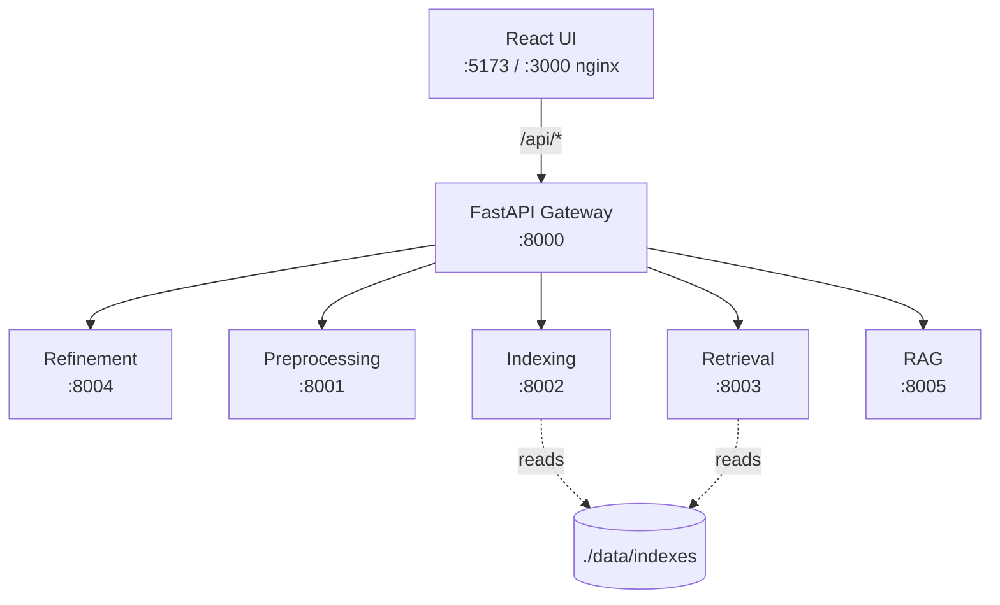

# Architecture

> Updated through **Phase 4**. Phase 6 will expand this with the gateway
> routing rules, error-handling patterns, and the per-service health
> contract.

## High-level diagram



## Services (from SOLO_DEVELOPER_GUIDE §6.1)

| Service | Port (dev) | Purpose | Status |
|---------|------------|---------|--------|
| gateway | 8000 | Public entry, routing, CORS | ⏳ Phase 6 |
| preprocessing | 8001 | Text preprocessing (Phase 1 pipeline) | ✅ Phase 1 |
| indexing | 8002 | Inverted index, TF-IDF, BM25 (lexical) | ✅ Phase 2 |
| retrieval | 8003 | Embeddings, FAISS (semantic) | ✅ Phase 3 |
| refinement | 8004 | Query refinement (spell, synonyms, grammar, personalize) | ✅ Phase 4 |
| rag | 8005 | RAG answer generation | ⏳ Phase 8 |
| ui | 5173 / 3000 | React frontend (Vite dev / nginx prod) | ✅ Phase 0 |

## Indexing vs Retrieval contract

The two retrieval services have **asymmetric** search contracts because
the input is shaped differently:

* `indexing` (`:8002`) takes pre-tokenised `query_tokens` (output of the
  preprocessing service). The user-facing gateway will call preprocessing
  first, then index. Internally:
  * `model="inverted"` → sum-tf across tokens; no real ranking.
  * `model="tfidf"` → sklearn `TfidfVectorizer.transform()` +
    `IndexFlatIP`-like dot product via the matrix.
  * `model="bm25"` → `bm25s.BM25().get_scores(token_ids)`, sorted desc.
  * `model="dense"` → **400 redirect** to `:8003`. The contract is too
    different to handle here.

* `retrieval` (`:8003`) takes **raw text** `query` (the encoder has its
  own WordPiece BPE tokenizer). Output is cosine similarity scores.
  * `model="dense"` is the only model on this service.

The gateway (Phase 6) will inspect `req.model` and route to the right
service, then translate the response back to a uniform shape for the UI.

## On-disk data layout

```
data/
├── processed/                      # Phase 1 output (gitignored)
│   ├── touche2020/
│   │   ├── docs.jsonl              # raw doc text (used by dense)
│   │   ├── tokens.jsonl            # preprocessed tokens (used by lexical)
│   │   ├── sample_meta.json
│   │   └── tokenize_meta.json
│   └── nq/  (same)
│
├── indexes/                        # Phase 2 + 3 output (gitignored)
│   ├── touche2020/
│   │   ├── inverted.pkl            # Phase 2: dict-of-dicts
│   │   ├── tfidf_matrix.npz        # Phase 2: scipy sparse
│   │   ├── tfidf_vectorizer.pkl    # Phase 2: sklearn TfidfVectorizer
│   │   ├── bm25.pkl                # Phase 2: bm25s BM25 (precomputed scores)
│   │   ├── bm25_token_ids.pkl      # Phase 2: token-id corpus
│   │   ├── bm25_vocab.json         # Phase 2: token -> id
│   │   ├── doc_ids.json            # Phase 2 + 3: position -> doc_id (shared)
│   │   ├── build_meta.json         # Phase 2 + 3 build stats (overwritten by Phase 3)
│   │   ├── faiss.index             # Phase 3: IndexFlatIP — 560 MB at 382K
│   │   └── embeddings.npy          # Phase 3: float32 (N, 384) — 560 MB
│   └── nq/  (same, ~732 MB faiss + 732 MB npy at 500K)
│
├── models/                         # sentence-transformers cache (gitignored)
│   └── sentence-transformers__all-MiniLM-L6-v2/
│
├── dicts/                          # Phase 4 spell dictionaries (gitignored)
│   └── frequency_dictionary_en_82_765.txt  # SymSpell, 1.3 MB
│
├── user_logs/                      # Phase 4 personalization (gitignored)
│   ├── user_1.jsonl                # 53 synthetic past queries + click counts
│   └── user_2.jsonl
│
├── grammar/                        # Phase 4 LanguageTool .jar cache (gitignored, opt-in)
│
├── downloads/                      # misc download cache (gitignored)
│
├── *.log                           # runtime logs (gitignored)
└── *.json                          # misc scratch (gitignored)
```

## GPU path (Phase 3 detail)

The retrieval service is the first one in the project that uses GPU.
On a CUDA-capable host (GTX 1650, RTX 30/40-series, A100, etc.):

1. `EMBED_DEVICE` auto-detects at import: `torch.cuda.is_available()` →
   `"cuda"`. Override with `IR_EMBED_DEVICE=cpu|cuda`.
2. On `"cuda"`, `USE_FP16 = True`. The encoder is cast to half precision
   via `st[0].auto_model = st[0].auto_model.half()` in
   `services/retrieval/app/embedder.py`.
3. Default batch size is 256 on GPU (empirically the sweet spot;
   512 and 1024 were *slower* on the small MiniLM model — see
   PHASE_3.md §4). At 256 docs × 256 tokens × 384 dim × 2 bytes
   (fp16), peak activation memory is ~1.0 GB VRAM.
4. `torch` must be installed with CUDA support. The default `pip install
   torch` pulls the CPU-only wheel (~200 MB); for GPU you need the
   `+cu121` variant (~2.4 GB on PyPI). `make install-torch-gpu` handles
   the install.

This is the first of (likely) two GPU services: RAG (Phase 8) will also
load a 1-3B LLM in fp16, which will share the 4 GB VRAM with the encoder
cache (LRU-1: one model in VRAM at a time, switch evicts the other).

## Query refinement pipeline (Phase 4)

The refinement service sits **before** both lexical and dense search
in the gateway's request flow:

```
user query "recieve teh helo from teh park, with eiffel"
        │
        ▼
   :8004  Refinement service
        │
        │ 1. grammar (opt-in; off by default)  ─▶ LanguageTool Java subprocess
        │ 2. spell (SymSpell + Damerau)        ─▶ "receive tech help from tech park, with eiffel"
        │ 3. synonyms (WordNet)                ─▶ "... eiffel column pillar ..."
        │ 4. tokenize (shared preprocess)      ─▶ ["receiv", "tech", "help", ...]
        │ 5. personalize (user_log.jsonl)      ─▶ [{"token": "eiffel", "weight": 2.0}, ...]
        │
        ▼
   { "refined_query", "expanded_query", "tokens", "weighted_tokens", "stages" }
        │
        ▼
   :8002 / :8003 search (Phase 5+)
```

The output of `/refine` is the canonical "clean user query" the rest
of the system uses. Phase 5's hybrid retriever will read
`weighted_tokens[*].weight` and apply it as a term-frequency
multiplier on the BM25 path (`tf *= weight`). The dense retriever
ignores weights (the encoder is a black box), so personalization
only affects lexical search — that's intentional, since user
preferences for "climate" terms are best expressed as BM25
boosts, not as different query embeddings.

