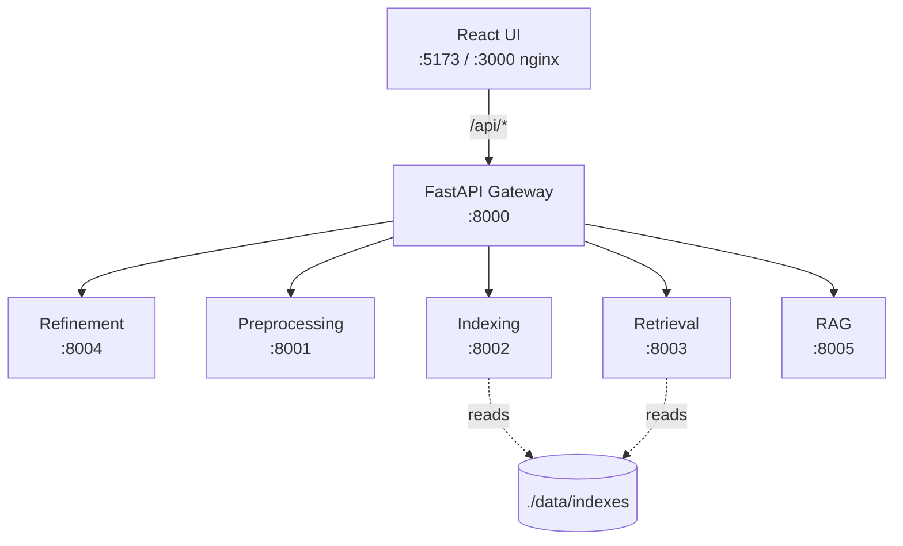

# Architecture

> Updated through **Phase 8**.

## High-level diagram



## Services (from SOLO_DEVELOPER_GUIDE §6.1)

| Service | Port (dev) | Port (docker) | Purpose | Status |
|---------|------------|---------------|---------|--------|
| gateway | 8000 | 8000 | Public entry, routing, CORS, X-Request-ID | ✅ Phase 6 |
| preprocessing | 8001 | 8000 (internal) | Text preprocessing (Phase 1 pipeline) | ✅ Phase 1 |
| indexing | 8002 | 8000 (internal) | Inverted index, TF-IDF, BM25 (lexical) | ✅ Phase 2 |
| retrieval | 8003 | 8000 (internal) | Embeddings, FAISS (semantic) | ✅ Phase 3 |
| retrieval (hybrid) | 8003 | 8000 (internal) | 5-rep hybrid + multi-encoder | ✅ Phase 5 |
| refinement | 8004 | 8000 (internal) | Query refinement (spell, synonyms, grammar, personalize) | ✅ Phase 4 |
| rag | 8005 | 8000 (internal) | RAG answer generation (TinyLlama-1.1B, auto-detect GPU) | ✅ Phase 8 |
| ui | 5173 / 3000 | 80 (nginx) | React frontend (Vite dev / nginx prod) | ✅ Phase 0 |

**In docker-compose**: only `gateway:8000` and `ui:3000` publish host
ports. The 4 backend services bind to internal port 8000 (same
container port, different hostnames) and are reachable only via
service-name DNS (`http://preprocessing:8000`, etc.).

## Indexing vs Retrieval contract

The two retrieval services have **asymmetric** search contracts because
the input is shaped differently:

* `indexing` (`:8002`) takes pre-tokenised `query_tokens` (output of the
  preprocessing service). The user-facing gateway will call preprocessing
  first, then index. Internally:
  * `model="inverted"` → sum-tf across tokens; no real ranking.
  * `model="tfidf"` → sklearn `TfidfVectorizer.transform()` +
    `IndexFlatIP`-like dot product via the matrix.
  * `model="bm25"` → `bm25s.BM25().get_scores(token_ids)`, sorted desc.
  * `model="dense"` → **400 redirect** to `:8003`. The contract is too
    different to handle here.

* `retrieval` (`:8003`) takes **raw text** `query` (the encoder has its
  own WordPiece BPE tokenizer). Output is cosine similarity scores.
  * `model="dense"` is the only model on this service.

The gateway (Phase 6) will inspect `req.model` and route to the right
service, then translate the response back to a uniform shape for the UI.

## On-disk data layout

```
data/
├── processed/                      # Phase 1 output (gitignored)
│   ├── touche2020/
│   │   ├── docs.jsonl              # raw doc text (used by dense)
│   │   ├── tokens.jsonl            # preprocessed tokens (used by lexical)
│   │   ├── sample_meta.json
│   │   └── tokenize_meta.json
│   └── nq/  (same)
│
├── indexes/                        # Phase 2 + 3 + 5 output (gitignored)
│   ├── touche2020/
│   │   ├── inverted.pkl            # Phase 2: dict-of-dicts
│   │   ├── tfidf_matrix.npz        # Phase 2: scipy sparse
│   │   ├── tfidf_vectorizer.pkl    # Phase 2: sklearn TfidfVectorizer
│   │   ├── bm25.pkl                # Phase 2: bm25s BM25 (precomputed scores)
│   │   ├── bm25_token_ids.pkl      # Phase 2: token-id corpus
│   │   ├── bm25_vocab.json         # Phase 2: token -> id
│   │   ├── doc_ids.json            # Phase 2 + 3 + 5: position -> doc_id (shared)
│   │   ├── build_meta.json         # Phase 3 build stats (L6)
│   │   ├── faiss.index             # Phase 3: IndexFlatIP (L6) — 560 MB at 382K
│   │   ├── embeddings.npy          # Phase 3: float32 (N, 384) (L6) — 560 MB
│   │   ├── build_meta_l12.json     # Phase 5 build stats (L12)
│   │   ├── faiss_l12.index         # Phase 5: IndexFlatIP (L12) — 560 MB
│   │   └── embeddings_l12.npy      # Phase 5: float32 (N, 384) (L12) — 560 MB
│   └── nq/  (same, ~732 MB L6 + ~732 MB L12 = ~1.47 GB per encoder × 2 encoders = 2.94 GB at 500K)
│
├── models/                         # sentence-transformers cache (gitignored)
│   ├── sentence-transformers__all-MiniLM-L6-v2/   # Phase 3, 90 MB
│   └── sentence-transformers__all-MiniLM-L12-v2/  # Phase 5, 120 MB
│
├── dicts/                          # Phase 4 spell dictionaries (gitignored)
│   └── frequency_dictionary_en_82_765.txt  # SymSpell, 1.3 MB
│
├── user_logs/                      # Phase 4 personalization (gitignored)
│   ├── user_1.jsonl                # 53 synthetic past queries + click counts
│   └── user_2.jsonl
│
├── grammar/                        # Phase 4 LanguageTool .jar cache (gitignored, opt-in)
│
├── downloads/                      # misc download cache (gitignored)
│
├── *.log                           # runtime logs (gitignored)
└── *.json                          # misc scratch (gitignored)
```

## GPU path (Phase 3 detail)

The retrieval service is the first one in the project that uses GPU.
On a CUDA-capable host (GTX 1650, RTX 30/40-series, A100, etc.):

1. `EMBED_DEVICE` auto-detects at import: `torch.cuda.is_available()` →
   `"cuda"`. Override with `IR_EMBED_DEVICE=cpu|cuda`.
2. On `"cuda"`, `USE_FP16 = True`. The encoder is cast to half precision
   via `st[0].auto_model = st[0].auto_model.half()` in
   `services/retrieval/app/embedder.py`.
3. Default batch size is 256 on GPU (empirically the sweet spot;
   512 and 1024 were *slower* on the small MiniLM model — see
   PHASE_3.md §4). At 256 docs × 256 tokens × 384 dim × 2 bytes
   (fp16), peak activation memory is ~1.0 GB VRAM.
4. `torch` must be installed with CUDA support. The default `pip install
   torch` pulls the CPU-only wheel (~200 MB); for GPU you need the
   `+cu121` variant (~2.4 GB on PyPI). `make install-torch-gpu` handles
   the install.

This is the first of (likely) two GPU services: RAG (Phase 8) will also
load a 1-3B LLM in fp16, which will share the 4 GB VRAM with the encoder
cache (LRU-1: one model in VRAM at a time, switch evicts the other).

## Query refinement pipeline (Phase 4)

The refinement service sits **before** both lexical and dense search
in the gateway's request flow:

```
user query "recieve teh helo from teh park, with eiffel"
        │
        ▼
   :8004  Refinement service
        │
        │ 1. grammar (opt-in; off by default)  ─▶ LanguageTool Java subprocess
        │ 2. spell (SymSpell + Damerau)        ─▶ "receive tech help from tech park, with eiffel"
        │ 3. synonyms (WordNet)                ─▶ "... eiffel column pillar ..."
        │ 4. tokenize (shared preprocess)      ─▶ ["receiv", "tech", "help", ...]
        │ 5. personalize (user_log.jsonl)      ─▶ [{"token": "eiffel", "weight": 2.0}, ...]
        │
        ▼
   { "refined_query", "expanded_query", "tokens", "weighted_tokens", "stages" }
        │
        ▼
   :8002 / :8003 search (Phase 5+)
```

The output of `/refine` is the canonical "clean user query" the rest
of the system uses. Phase 5's hybrid retriever will read
`weighted_tokens[*].weight` and apply it as a term-frequency
multiplier on the BM25 path (`tf *= weight`). The dense retriever
ignores weights (the encoder is a black box), so personalization
only affects lexical search — that's intentional, since user
preferences for "climate" terms are best expressed as BM25
boosts, not as different query embeddings.

## Phase 5 — hybrid / multi-encoder dispatch

Phase 5 adds three new endpoints to the existing :8003 service
(no new port; the orchestrator lives in-process):

```
  POST /hybrid/{ds}/search          ─▶  HybridOrchestrator (5 reps)
  POST /multi-encoder/{ds}/search   ─▶  MultiEncoderRunner (L6 + L12)
  GET  /hybrid/{ds}/health          ─▶  HybridHealthResponse
```

```
┌──────────────────────────────────────────────────────────┐
│                       :8003 service                      │
│                                                          │
│  /hybrid/{ds}/search                                     │
│      │                                                   │
│      ▼                                                   │
│  HybridOrchestrator                                      │
│      │  if representation == "tfidf":      httpx :8002   │
│      │  if representation == "bm25":       httpx :8002   │
│      │  if representation == "embedding":  in-proc FAISS │
│      │  if representation == "hybrid_serial":   BM25 → dense re-rank │
│      │  if representation == "hybrid_parallel": asyncio.gather(B, D) │
│      │  personalization × BM25 scalar                    │
│      │  refinement (if mode == with_features)             │
│      │      └─▶ httpx :8004; falls back to basic on err  │
│      │                                                   │
│      ▼                                                   │
│  fuse(rrf | combsum | combmnz)                           │
│      │                                                   │
│      ▼                                                   │
│  HybridSearchResponse                                    │
│                                                          │
│  /multi-encoder/{ds}/search                              │
│      │                                                   │
│      ▼                                                   │
│  MultiEncoderRunner                                      │
│      │  asyncio.gather(                                   │
│      │     encode + FAISS-search(L6, faiss.index),        │
│      │     encode + FAISS-search(L12, faiss_l12.index))   │
│      │                                                   │
│      ▼                                                   │
│  fuse(rrf | combsum | combmnz)                           │
└──────────────────────────────────────────────────────────┘
```

Caches and singletons:

* `_EMBEDDER` — singleton `Embedder` with LRU-2 model cache
  (`MODEL_CACHE_SIZE = 2`). Holds L6 + L12 in memory at the same time.
* `_FAISS_CACHE_2` — singleton `OrderedDict[(dataset_id, index_filename), DenseIndex]`
  with `OrderedDict.popitem(last=False)` eviction. Both L6 and L12
  indexes can be hot simultaneously.
* `_ORCHESTRATOR` / `_DENSE_CLOSURE` / `_MULTI_ENCODER_CLOSURE` —
  module-level lazy singletons. The first request to a 3-tuple of
  endpoints pays the full LRU warm-up; subsequent requests are O(1)
  module lookup.

Upstream reachability is probed by the `/hybrid/{ds}/health`
endpoint via 0.5 s httpx GETs to `:8002/health` and `:8004/health`.
A downstream that's down is reported as a `false` boolean in the
response — the health endpoint is always fast and never fails.

The `mode=with_features` fall-back is **fail-open**: if `:8004` is
unreachable, the orchestrator silently uses the original query and
sets `refinement_fell_back = True` in the response. Search still
works, just without spell-correction / synonyms / personalisation.

## Phase 6 — Gateway routing & error model

The gateway is a **thin router**. No ranking logic lives here. The
phase adds:

* A FastAPI app on `:8000` with 7 routes + 1 stub.
* 4 backend-service clients (`PreprocessingClient`, `IndexingClient`,
  `RetrievalClient`, `RefinementClient`) wrapping `httpx.AsyncClient`
  with structured error translation.
* `RequestContextMiddleware` adding `X-Request-ID` (UUID4 or
  caller-supplied) and per-request latency logging.
* CORS tightened to 4 local-UI origins on all 5 services.

### Gateway route table

| Method | Path | Body | → Downstream | Status |
|--------|------|------|--------------|--------|
| GET | `/` | — | (landing page) | 200 |
| GET | `/health` | — | 4 parallel probes (0.5s each) | 200 |
| GET | `/api/datasets` | — | — | 200 |
| POST | `/api/search` | `GatewaySearchRequest` | :8001→:8002 (tfidf/bm25) OR :8003 (emb/hybrid) | 200/400/422/502/503 |
| POST | `/api/multi-encoder/{ds}/search` | `MultiEncoderSearchRequest` | :8003 | 200/400/422/502/503 |
| POST | `/api/refine` | `RefineRequest` | :8004 | 200/422/502/503 |
| POST | `/api/log/click` | `LogClickRequest` | :8004 `/log/click` (new) | 204/422/502/503 |
| POST | `/api/rag/answer` | `RagRequest` | :8005 `/rag/answer` | 200/422/502/503 |
| GET | `/api/docs/{ds}/{id}` | — | :8001 `/docs/{ds}/{id}` | 200/400/502/503 |

### `/api/search` routing

```
GatewaySearchRequest.representation:
  "tfidf"           → :8001 /preprocess → :8002 /index/{ds}/search  (model="tfidf")
  "bm25"            → :8001 /preprocess → :8002 /index/{ds}/search  (model="bm25")
  "embedding"       → :8003 /hybrid/{ds}/search     (orchestrator handles :8002/:8004)
  "hybrid_serial"   → :8003 /hybrid/{ds}/search
  "hybrid_parallel" → :8003 /hybrid/{ds}/search
```

For embedding/hybrid the gateway passes the request body verbatim
(`model_dump()`) to `:8003`. The Phase 5 orchestrator handles BM25 +
refinement on its own.

### Error translation

| Client raises | Gateway returns |
|---------------|-----------------|
| `BackendClientError` 4xx | 400 (with `GatewayErrorResponse` body) |
| `BackendClientError` 5xx | 502 |
| `BackendUnreachable` | 503 (`reachable=false, status_code=null`) |

Body shape:
```json
{
  "service": "indexing",
  "reachable": false,
  "status_code": null,
  "detail": "ConnectError: connection refused"
}
```

### `log/click` flow

```
React UI  POST /api/log/click {user_id, query, doc_id, dataset_id}
   │ Pydantic validates LogClickRequest (user_id regex 422s on bad input)
   ▼
Gateway  body.model_dump() forwarded
   ▼
Refinement  POST /log/click (status_code=204, no body)
   ▼
data/user_logs/<user_id>.jsonl  (path-traversal-safe via user_log_path())
   │ UserLogEntry.to_jsonl_line() = {"ts":<float>, "query":<str>, "clicked_doc_ids":[<str>]}
   ▼
Aggregated by personalization.py:183-204
```

### Docker stack

* **One shared Dockerfile** (`services/backend.Dockerfile`) with
  `ARG SERVICE_NAME` (default `preprocessing`) and `ARG BASE_IMAGE`
  (default `python:3.12-slim`). Each backend service is built with
  `--build-arg SERVICE_NAME=<name>`.
* **Two compose files**: `docker-compose.yml` (CPU, default) +
  `docker-compose.gpu.yml` (overlay). Merged via
  `docker compose -f docker-compose.yml -f docker-compose.gpu.yml up`.
  The overlay only overrides the `retrieval` service: GPU base image,
  `runtime: nvidia`, `IR_EMBED_DEVICE=cuda`, nvidia deploy reservations.
* **UI nginx.conf** proxies `/api/` to `http://gateway:8000/` (the
  trailing `/` strips the `/api/` prefix).
* **CORS** tightened to 4 local-UI origins on every service. Env-driven
  for the gateway (`GATEWAY_CORS_ORIGINS`).

## Live Docker stack status (2026-06-07)

The Docker framework (`docker-compose.yml` + `docker-compose.gpu.yml` +
`services/backend.Dockerfile` + `services/ui/Dockerfile` +
`services/ui/nginx.conf`) is **fully implemented and committed** (Phase
6 commits `ee6eb4e` + `a9e956d`); `docker compose config` validates
without warnings. **Live validation of the running stack is deferred**:
of the 6 services, only `gateway` and `ui` were built (then lost in the
Docker Desktop daemon crash documented in PHASE_6.md §15); the 4
backend service images are pending a future build session with
adequate bandwidth. The user's C: drive had 9.51 GB free at the time of
the crash, which contributed to the BuildKit deadlock; this was
mitigated by moving Docker storage to G: drive (77.7 GB free) so future
builds have ample headroom. See [PHASE_6.md §15](PHASE_6.md#15-live-build-session--incident-report-2026-06-06) for the full incident report.

